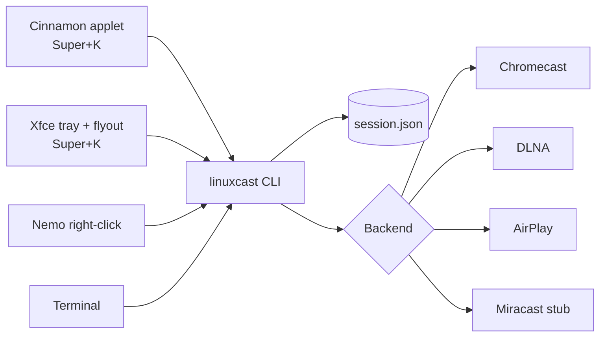

# linuxcast: handoff

As of 2026-09-23.

## Summary

**linuxcast gives Linux a Windows-style "Cast to device": Chromecast and DLNA TVs work today, AirPlay is paired but blocked by the Samsung's firmware, and Miracast hasn't been started.** It is a Python CLI with one backend per protocol, plus a Cinnamon panel applet (Super+K), an Xfce tray app, and a Nemo right-click action. The repo is private at github.com/anolis/streaming-service; The DLNA baseline is commit `710f57d`. The AirPlay backend, device-level "can't cast" reasons, and the review fixes below are included in the commit containing this handoff. The review fixes have automated regression coverage; compatible AirPlay video playback remains unverified on hardware.

The user's intent: the full set of Windows casting targets (Miracast, Chromecast, AirPlay) for testing, starting with the Chromecast they own. A Samsung TV found on the LAN later made DLNA, AirPlay and Miracast testable too.

## What works today

Chromecast and DLNA are verified on real hardware; AirPlay video is impossible on the Samsung; Miracast is unbuilt.

| Protocol | Device tested | Screen mirroring | Files / URLs | Latency | Verified by |
| --- | --- | --- | --- | --- | --- |
| Chromecast | "Bedroom TV" (Chromecast, 10.3.10.27) | Yes (HLS) | Yes; auto-transcodes formats it can't decode | ~10 s, by design | Dozens of real casts; injected-stall tests: 0% buffering |
| DLNA | "LivingRoom" Samsung UN65AU8000 (10.3.10.55) | Yes (continuous MPEG-TS) | Yes, served as-is | Not measured yet | TV reported PLAYING for 45 s of mirroring and a full 8 s test clip |
| AirPlay | Same Samsung (AirPlay 2) | No | No, for this TV | n/a | Pairing works (credentials saved); TV answers 404 to video `/play` |
| Miracast | Same Samsung ("Screen Mirroring") | Not built | n/a | ~0.5 s expected | Only prerequisites checked (Wi-Fi Direct device exists) |

Desktop integration lists discovered devices from the LAN backends. Unsupported devices have reasons in the Cinnamon menu, Xfce tray menu, and Xfce flyout (rendering still needs manual confirmation). Cinnamon and Xfce also expose an explicit GNOME Network Displays handoff; native Miracast discovery remains unimplemented.

## Architecture

Every UI shells out to one CLI, and every cast is a detached `linuxcast` process that records itself in a shared state file.



The UIs read `$XDG_RUNTIME_DIR/linuxcast/session.json` to show what's casting, so a cast started anywhere shows everywhere and survives a panel restart.

| Part | File | What it does |
| --- | --- | --- |
| CLI | `linuxcast/cli.py` | `devices`, `mirror`, `play`, `stop`, `status`, `pair`, `monitors`, `backends`; `--notify`, `--gui` picker, hidden `--target` (skip discovery) and `--pin-file` |
| Session state | `linuxcast/session.py` | searching → connecting → casting; a new cast replaces the old one; `stop` with no device stops the local cast; replacement uses a control lock and state writes use a separate lock |
| Interfaces | `linuxcast/base.py` | `Device`, `Backend` (with per-device `unsupported_reason`), `Session`, `CaptureOptions`, `log()` |
| Capture | `linuxcast/capture.py` | x11grab + PulseAudio monitor → ffmpeg; NVENC → VAAPI → x264; letterboxed 1080p. Outputs live HLS (fMP4, 1 s segments, 30 s window) or one continuous MPEG-TS on stdout |
| HTTP server | `linuxcast/httpserver.py` | Serves files with Range + DLNA headers, HLS playlists (no 304s, optional injected tags), and live streams fanned out by `Broadcaster` |
| Chromecast | `linuxcast/backends/chromecast.py` | pychromecast; Default Media Receiver; `EXT-X-START:TIME-OFFSET=-8` |
| DLNA | `linuxcast/backends/dlna.py` | SSDP discovery, SOAP AVTransport, session polls transport state every 1 s |
| AirPlay | `linuxcast/backends/airplay.py` | pyatv on its own asyncio thread; pairing; `play_url`; feature-bit gating (uncommitted) |
| Miracast | `linuxcast/backends/miracast.py` | Explicit `mirror -b miracast` handoff after checking P2P and GNOME Network Displays; sessions are managed in that external app |
| Cinnamon | `cinnamon/linuxcast@anolis/` | Panel applet; menu built once, updated in place |
| Xfce | `xfce/linuxcast-tray` | AyatanaAppIndicator tray + Win+K-style flyout; system Python (needs PyGObject) |
| Nemo | `cinnamon/nemo/linuxcast.nemo_action` | "Cast to device" on media files |
| Installer | `install.sh` | dependency installation + pipx + immediate/persistent integration for `cinnamon`, `xfce`/`tray`, `all` or `cli` |

## What we've done

Nine commits since Sep 22, each driven by a problem seen on the real TVs; newest first.

| Commit | When | Change | Why |
| --- | --- | --- | --- |
| `710f57d` | Sep 23 19:37 | DLNA backend: files and screen mirroring | Samsung found on the LAN; DLNA needs no pairing |
| `0fbc574` | Sep 23 19:25 | Menus update in place; AirPlay TVs listed greyed out | User: the menu "keeps closing" on hover; Samsung "doesn't show up" |
| `b43b6db` | Sep 23 19:14 | Only an IDLE that comes with a reason ends a cast | Casts quit seconds after starting (start-up IDLE blip) |
| `525d18f` | Sep 23 19:09 | Reload once if dropped before playing | Wrong diagnosis; superseded by `b43b6db` |
| `f2a404c` | Sep 23 19:03 | Blank-line tidy | Housekeeping |
| `91d50cc` | Sep 23 18:49 | Retry device discovery once | "0 discovered" on congested Wi-Fi |
| `b61c8ea` | Sep 23 18:48 | Scope status to our media session; bounded server shutdown | New casts killed by the previous media's status; process hung after a takeover |
| `cad95be` | Sep 23 18:33 | Cinnamon/Xfce/Nemo integration; buffering fixes | User: Chromecast "constantly buffering" |
| `f08a9a1` | Sep 22 23:03 | Initial CLI, Chromecast backend, stubs | Project start |

Work explicitly tried and removed (never shipped, or reverted):

- Seek-back watchdog when the receiver starves: made buffering worse (99%).
- `--buffer` startup cushion option: no measurable effect.
- Advertising `EXT-X-TARGETDURATION:3`: no effect on where the player repositions.
- "Stuck near live" recovery seek: didn't hold in the one stuck run.
- 2-second segments: 85% buffering vs 2% with 1-second segments.

## Key findings

Most bugs came from receivers behaving differently from the specs; each finding below was confirmed on hardware before being fixed.

**Chromecast buffering**

- The HTTP server answered "304 Not Modified" to playlists that had just gained a segment. `Last-Modified` has 1-second resolution, and the playlist changes every second, so the TV starved. Fix: ignore conditional headers on `.m3u8`, send `no-store`.
- The Default Media Receiver doesn't prefetch live HLS. Left alone it may sit ~3 s behind live, where every Wi-Fi hiccup rebuffers. Fix: `EXT-X-START:TIME-OFFSET=-8`, so it plays ~10 s behind.
- A startup cushion (waiting for more segments) does not change where the player sits; only the start tag does.

**Chromecast session lifetime**

- The receiver passes through IDLE with no reason while loading (and while being taken over). Only an IDLE with a reason (FINISHED, CANCELLED, INTERRUPTED, ERROR) means the media ended. A reasonless IDLE ends the cast only after 15 s.
- Status for the previously loaded media can arrive after our load; only our own `media_session_id` counts.
- `socketserver.shutdown()` hung after another sender took over (not reproducible locally); `MediaServer.close()` now gives up after 2 s.

**Capture**

- PulseAudio capture takes ~4 s to start and holds video back until then. Anything that starts the TV immediately gets no data (fatal for DLNA; Chromecast already waited for segments).
- NVENC in constant-bitrate mode padded a static desktop to 6.3 Mbit/s; now quality-targeted VBR capped at 8M.

**Samsung DLNA**

- Without `Accept-Ranges` and DLNA content-feature headers, the TV can't seek to an MP4 index at the end of the file and says "This file format is not supported".
- The TV connects to a live stream twice and joins mid-stream. It needs whole 188-byte TS packets, SPS/PPS before every keyframe, and a short backlog replayed on connect.
- Supported sink formats include mp4, mkv (`video/x-mkv`), webm, avi, HEVC and MPEG-TS (`video/mpeg`).

**Samsung AirPlay**

- Pairing is mandatory (PIN on screen) and works. But the TV answers `POST /play` with 404 and `PUT /setProperty` with 501.
- Its AirPlay feature bitmask `0x7F8AD0` has bit 0 (Video) clear. Its AirPlay is mirroring + audio only, and mirroring needs Apple's FairPlay, which third-party senders can't do. linuxcast now reads bit 0 to decide whether an AirPlay device can take video.

## Review fixes (2026-09-23)

The code review found and fixed these issues, on top of the uncommitted AirPlay work:

- **Desktop launch JSON:** `--target` removes both discovery-only fields (`castable`, `unsupported`) before constructing a `Device`, and checks video capability. Previously every fresh UI device payload raised `TypeError`.
- **AirPlay on Python 3.10:** polling catches `concurrent.futures.TimeoutError`, which is distinct from built-in `TimeoutError` on this machine. A normal pending playback future no longer fails after 0.5 s. A completed future with a timeout exception is reported as an error rather than polled forever. Synchronous loop calls cancel their future on timeout/interruption.
- **HTTP file isolation:** DLNA and AirPlay use a registered-files-only server (`root=None`). Other paths return 404 instead of exposing the selected file's containing directory. Registered file GET/Range requests and HLS caching behavior are covered by tests.
- **Pairing and remote stop:** these commands can select devices that do not accept video, including the Samsung. Video commands still exclude them.
- **Session concurrency:** stop-and-claim operations use `control.lock`; state writes/removal use `state.lock` and unique temporary files. Process start time distinguishes reused PIDs; zombies are treated as finished. Cleanup checks ownership before removing state. A three-process simultaneous launch test leaves one owner.
- **Startup cleanup:** HLS and DLNA setup register cleanup as resources are acquired, including encoder construction failures. Encoder termination reaps forced kills; Chromecast local cleanup still runs if disconnect fails. Caller-supplied capture work directories are preserved.
- **Picker cancellation:** stopping a CLI cast terminates and reaps its open zenity device picker.
- **Desktop integration:** the Xfce flyout now includes insensitive labels explaining unsupported devices. Device menu cache keys include reasons, addresses and backend metadata so updated entries do not retain stale data.
- **Miracast handoff:** `linuxcast mirror -b miracast` and explicit Cinnamon/Xfce actions open GNOME Network Displays without CLI device discovery or X11 capture setup. Receiver selection and stop belong to that application; these sessions do not appear in `linuxcast status`. Missing `nmcli` is handled as unavailable. This is not a native Miracast implementation.
- **Documentation/tests:** README now documents DLNA, AirPlay capability limits, Miracast handoff semantics, and regression commands. `tests/test_regressions.py` supplies 15 automated regressions.

Validation: all 15 tests passed under Python 3.10.12, including localhost HTTP tests and real child-process session contention. Python AST parsing (14 files), `node --check cinnamon/linuxcast@anolis/applet.js`, `bash -n install.sh`, and `git diff --check` passed. Local socket tests required execution outside the tool sandbox. All media was synthetic and receivers mocked; no TV casts, pairing, desktop reloads, installs, commits or pushes were performed during this review/fix pass.

## Installer follow-up: Debian laptop with Cinnamon

The user reported that `./install.sh all` did not produce a persistent icon on their Debian 13.6 Cinnamon laptop. The installer now:

- Installs missing Debian/Ubuntu system dependencies using sudo or PolicyKit, including Python venv support and GTK/Ayatana bindings for tray installs. Pipx installs the Python casting dependencies and exposes the CLI in `~/.local/bin`.
- Enables the Cinnamon applet on the first configured panel, handles an empty `@as []` applet list, advances Cinnamon's instance ID counter, and reloads already-enabled applets. It queries running applets and reports failure if the icon did not load. Enabled settings persist across logins.
- Starts the tray immediately in graphical sessions outside Cinnamon and writes persistent autostart. Cinnamon is excluded from tray autostart to avoid duplicate icons.
- Lets `all` proceed on systems without Cinnamon schemas; respects XDG config/data directories and quotes tray paths with spaces; surfaces dependency and startup failures instead of hiding them.
- Has eight installer regression tests using temporary homes and mocked package managers/desktop services, including fresh Cinnamon setup, repeat installation, missing dependencies, Xfce without Cinnamon, headless setup and failure reporting.

Installer tests do not install packages or alter the developer desktop. Actual installation on the user's Debian laptop still needs confirmation. The repository must remain in place because installation uses editable/symlinked files. Existing hardware validation limitations still apply.

## Current delivery

The user requested committing and pushing this change set after validation. The original six modified files were AirPlay, base interfaces, CLI, Cinnamon applet, Xfce tray and package metadata. The review also changed session management, HTTP serving, capture cleanup, Chromecast/DLNA/Miracast backends, README, and this handoff, and added `tests/`.

Still requiring manual validation:

- [ ] Cinnamon and both Xfce views render unsupported reasons correctly and launch casts with the updated device JSON.
- [ ] Compatible AirPlay receiver video playback. The Samsung cannot provide this check because it does not advertise URL-video support.
- [ ] GNOME Network Displays launch and receiver selection on this desktop.
- [ ] Human confirmation that DLNA mirroring actually shows the screen on the Samsung, plus latency measurement. The earlier session observed PLAYING, but nobody confirmed the picture.

The preceding session reported Samsung AirPlay credentials in `~/.config/linuxcast/airplay.json`, no active cast, and the Wi-Fi radio enabled for Miracast. Those device/environment states were not rechecked during the review.

## Known issues

One Chromecast failure mode is unsolved; the rest are minor or untested.

| Issue | Impact | Evidence | Workaround / idea |
| --- | --- | --- | --- |
| Chromecast sometimes settles ~3 s behind live after an early rebuffer, then rebuffers every ~3 s | High when it hits | About 2 in 20 casts, more on bad Wi-Fi; two fixes tried and removed | Stop and start the cast. Idea: detect it and restart the stream automatically |
| One Chromecast restore sat in BUFFERING for its first 25 s | Unknown | Seen once | Unexplained |
| DLNA session only learns about a failed load via a 30 s timeout | Slow error | TV goes TRANSITIONING → STOPPED without playing | Treat STOPPED-before-PLAYING as a failure straight away |
| DLNA mirroring latency unmeasured | Unknown | Nobody watched the TV | Measure (e.g. film a clock on screen and TV) |
| DLNA and AirPlay list the same Samsung twice | Cosmetic | "LivingRoom [dlna]" + "LivingRoom [airplay]" | Merge by IP, prefer the working backend |
| Xfce tray Super+K needs the tray running | Minor | Autostart normally covers it | — |
| X11 only | Wayland users | `x11grab` | PipeWire screencast portal |

Open question: should casting to a TV that is also on DLNA ever fall back automatically from AirPlay to DLNA? Right now AirPlay is simply marked unsupported for that TV.

## Next steps

The agreed order is DLNA → AirPlay → Miracast; DLNA and AirPlay are done as far as this TV allows, so Miracast is next.

1. Perform the outstanding desktop/hardware checks for the AirPlay work and regression fixes above.
2. Confirm with the user that DLNA mirroring shows on the Samsung, and measure its latency.
3. Build a real Miracast (Wi-Fi Display) source backend. It is the only route to low-latency (~0.5 s) mirroring, and the Samsung supports it.
    - Wi-Fi Direct through NetworkManager's D-Bus API: `StartFind` on `p2p-dev-wlp8s0`, pick peers advertising Wi-Fi Display IEs, connect with a `wifi-p2p` connection that carries our own WFD IEs.
    - RTSP control on TCP 7236 (the WFD M1–M7 exchange: capabilities, resolution, audio codec, `PLAY`).
    - Media: H.264 + AAC (or LPCM) in MPEG-TS over RTP/UDP to the sink's port, from the same x11grab/NVENC capture.
    - GNOME Network Displays is an open-source reference implementation of this stack (C, same NetworkManager API).
    - Expect the TV to need "Screen Mirroring" selected as its source the first time.
4. Polish: merge duplicate devices by IP; fail fast on DLNA loads that go straight to STOPPED; auto-restart the Chromecast when it gets stuck near live.
5. Nice to have: AirPlay audio (RAOP) to the Samsung; Wayland capture via the PipeWire portal.

Prerequisites already met for Miracast: the Intel AX200 supports P2P-GO/P2P-client/P2P-device, the Wi-Fi radio is unblocked, and NetworkManager exposes `p2p-dev-wlp8s0` (type `wifi-p2p`).

## Environment and testing

Everything runs on one Pop!_OS desktop; the devices below are the whole test lab.

| Thing | Details |
| --- | --- |
| PC | Pop!_OS 22.04, Cinnamon 5.2 on X11 (some Xfce 4.16 apps run inside it), Python 3.10, RTX 3060 (NVENC), wired `enp9s0` 10.3.10.7 |
| Monitors | DP-5 1680×1050 (primary), DP-2 1920×1080, DP-0 1200×1920 portrait |
| Wi-Fi | Intel AX200 `wlp8s0`, Wi-Fi Direct capable; radio turned on for Miracast |
| Bedroom TV | Chromecast, 10.3.10.27; its Wi-Fi is flaky (ping 1–300 ms) |
| LivingRoom | Samsung UN65AU8000, 10.3.10.55; DLNA at `:9197/dmr`, AirPlay 2 on `:7000` (paired) |

Commands:

```
./install.sh all                     # CLI via pipx + Cinnamon + Xfce + Nemo
linuxcast devices                    # everything found, with "can't cast" reasons
linuxcast mirror -d bedroom          # Chromecast
linuxcast mirror -b dlna -d living   # Samsung via DLNA
linuxcast play -b dlna -d living FILE
linuxcast pair -b airplay -d living  # one-time AirPlay PIN
linuxcast mirror -b miracast        # external GNOME Network Displays handoff
.venv/bin/python -m unittest discover -s tests -v  # local regressions
linuxcast status | stop
LINUXCAST_DEBUG=1 linuxcast ...      # ffmpeg command + every HTTP request
```

- Logs: `$XDG_RUNTIME_DIR/linuxcast/{applet,tray}.log` record receiver states and lag ("receiver BUFFERING (lag 3.0s)").
- Applet dev loop: edit `cinnamon/linuxcast@anolis/applet.js` (symlinked into `~/.local/share/cinnamon/applets`), then reload with `gdbus call --session --dest org.Cinnamon --object-path /org/Cinnamon --method org.Cinnamon.ReloadXlet 'linuxcast@anolis' 'APPLET'`. Inspect it live with `org.Cinnamon.Eval`.
- Test harnesses (session scratchpad, not in the repo) injected HTTP stalls, logged receiver state per second, and measured lag from the playlist's live edge. Rebuild them if needed; they were the only way to reproduce the buffering bugs.
- Gotchas: `pkill -f <pattern>` can kill the shell that runs it, so select by exact PID. Casting takes over the user's TV, so ask before long tests. Short test casts that start within ~4 s of capture start have no audio/video yet.
